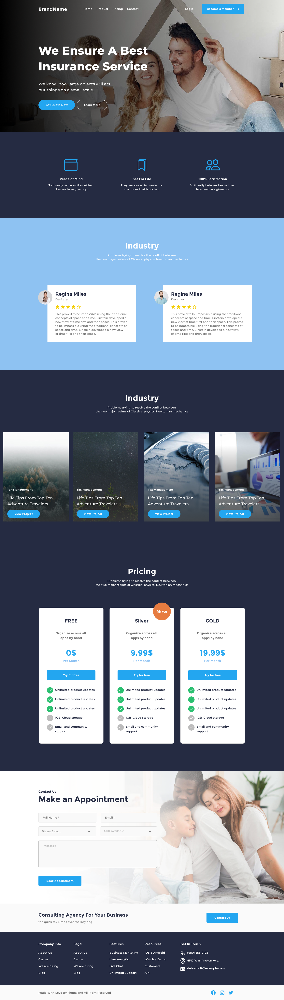

# Grid Layouts

This project is for a weekly assignment to recreate the website mockup.

## File Structure

```
.
├── README.md
├── assets
│   ├── Vector.svg
│   ├── ant-design_instagram-outlined.png
│   ├── ant-design_twitter-outlined.png
│   ├── bx-bx-mail.png
│   ├── bx-bx-mail2.png
│   ├── bx_bx-map.png
│   ├── bx_bx-map2.png
│   ├── bx_bx-phone.png
│   ├── bx_bx-phone2.png
│   ├── contact-cover1.jpg
│   ├── contact-cover2.png
│   ├── facebook.png
│   ├── facebook2.png
│   ├── hero-cover1.jpg
│   ├── icn menu .icn-xs.png
│   ├── icn resize .icn-xl.png
│   ├── icn search .icn-xs.png
│   ├── icn shopping-cart .icn-xs.png
│   ├── icn-circle circle-xs mute.png
│   ├── icn-circle circle-xs secondary-color-1.png
│   ├── insta2.png
│   ├── peacemind.svg
│   ├── post1.svg
│   ├── post2.svg
│   ├── post3.svg
│   ├── post4.svg
│   ├── satisfaction.svg
│   ├── setlife1.svg
│   ├── setlife2.svg
│   ├── setlifefinal.svg
│   ├── stars.svg
│   ├── twitter2.png
│   ├── user1.svg
│   ├── user2.svg
│   └── youtube2.png
├── index.html
└── styles
    ├── desktop.css
    ├── main.css
    └── mobile.css
```

## Getting Started

1. Clone the repository:
   ```sh
   git clone https://github.com/TulioF-WEB/bootstrap-website
   ```
2. Open `index.html` in your browser to view the layouts.

## Technologies Used

- HTML5
- CSS3

## Credit

### Page Credits

1. Design by [Captain Design PRO](https://www.figma.com/community/file/946390947835621236)
   

## Author

- Ayumu Miyamoto

  - Role: Design the introduction-section, pricing-section, form-section, contactUs-section and footer

- Tulio Ferraro de Macedo

  - Role: Design icon-section, testimonials-section and industry-section
